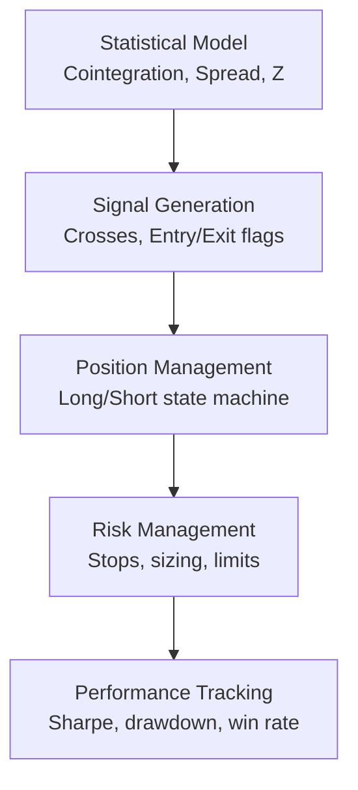
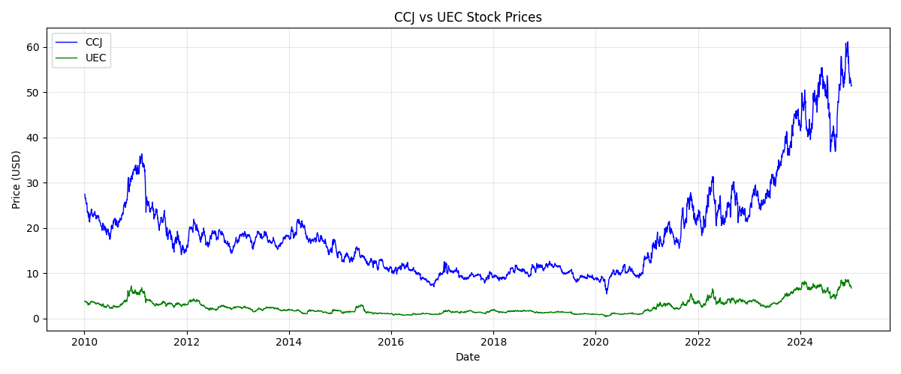
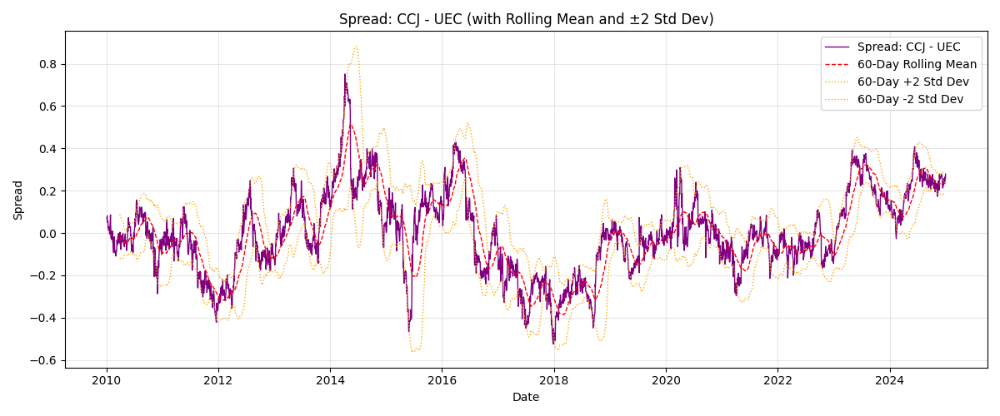
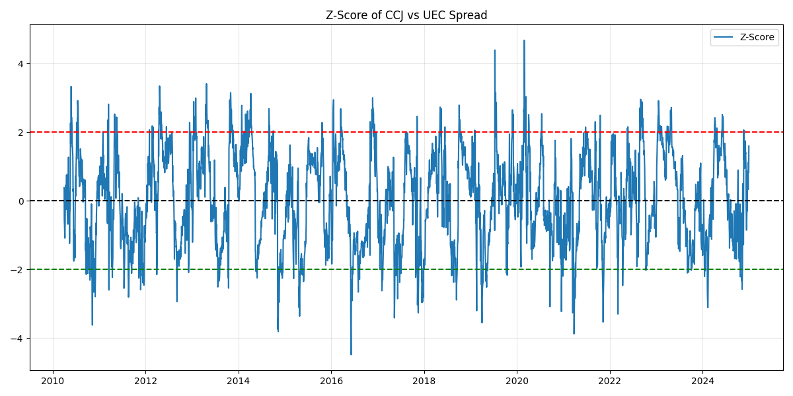
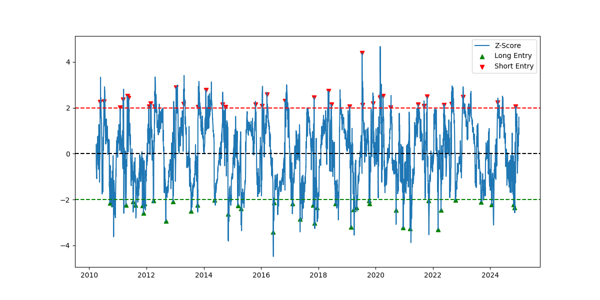
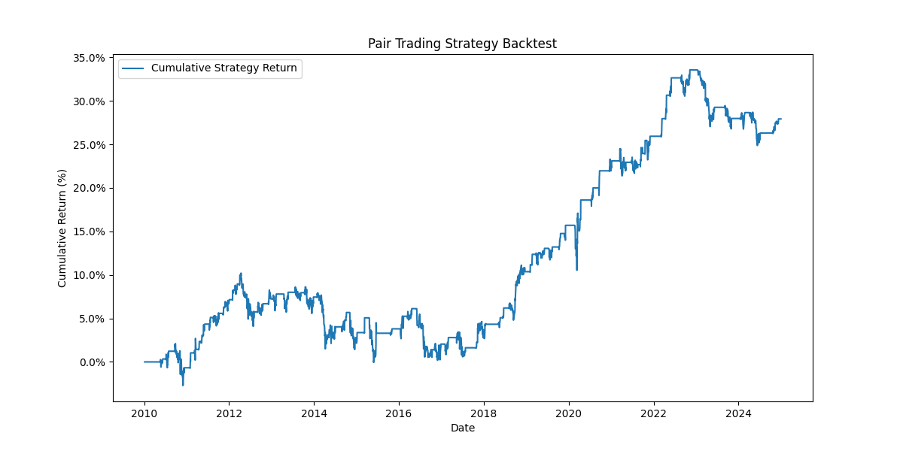

# Statistical Arbitrage High-Frequency Trading Model

this shit isnt even hft because its only backtested, im just trying to sound impressive.

this took me about 20 hours to make. ai barely understood this shit so i had to figure this out by myself.

the model compares two uranium stocks, ccj (cameco corp) and uec (uranium energy corp).

if you want to test it, clone the repo then run app.py. you can change the stocks if you want in constants.py

## how it works
ill explain how it works now.



### statistical model
the model first tests for cointegration between CCJ and UEC using the Engle-Granger test (statsmodels library). 

if the null hypothesis is rejected (p-value < 0.05), indicating a long-term relationship, it proceeds with OLS regression on log-transformed prices: log(CCJ) = α + β * log(UEC). 

The error correction term (spread) is then the residuals: spread_t = log(CCJ_t) - (α + β * log(UEC_t)). 

To normalize, a z-score is calculated as z_t = (spread_t - μ_rolling) / σ_rolling, using a 60-day rolling window for mean (μ) and standard deviation (σ). 

the z-score represents deviations from the equilibrium in standard deviations.

### signal generation
entry signals are cross-based thresholds on the z-score. long spread (bet CCJ will outperform UEC: long CCJ, short UEC) when z crosses below -2 (from above -2). short spread (bet UEC will outperform CCJ: short CCJ, long UEC) when z crosses above +2 (from below +2). exit conditions: when |z| drops below 0.5 from above, or |z| > 4 (extreme deviation stop), or z changes sign from entry threshold to opposite (e.g., entered long at z=-2, exit if z > 0). these flags generate entry/exit events for trades.

### position management
positions use a simple state machine: flat (0), long spread (+1), or short spread (-1). on entry, position size is fixed at 10% of capital per leg (e.g., 0.1 for each stock). long/short are equal-dollar positions in opposite directions to maintain market neutrality. transactions occur only on entry/exit flags.

### risk management
risk is managed via fixed position sizing (0.1 per leg, or 20% total exposure), assuming no leverage. transaction costs are deducted at 0.05% per trade per leg (modeled as 0.0005 multiplier). no advanced stops beyond the z-score thresholds, relying on statistical mean-reversion.

### performance tracking
backtest calculates key metrics: 

- Sharpe ratio (annualized: mean daily return / std dev * sqrt(252))
- total return (cumulative product of daily returns)
- max drawdown (peak-to-trough decline)
- win rate (% of profitable trades)
- average holding period
- average win/loss
- expectancy (mean trade return)

uses pandas pct_change for daily returns, cumprod for cumulative.

## results

so what actually happend? well, here is the output:

```
Total Return: 27.92%
Sharpe Ratio: 0.41
Max Drawdown: 10.26%
Win Rate: 80.77%
Average Holding Period: 30.47 days
Average Win: 0.87%
Average Loss: -2.03%
Expectancy: 0.31%
```

as you can see, it wasnt that great. but it was a learning experience.

## screenshots





